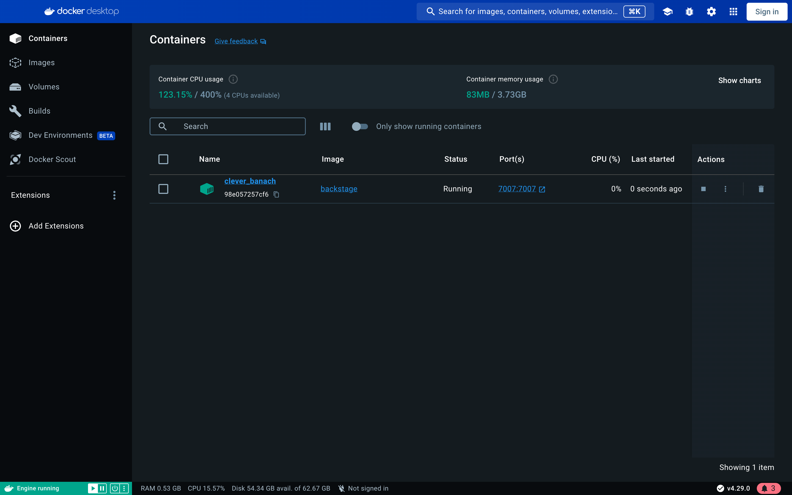
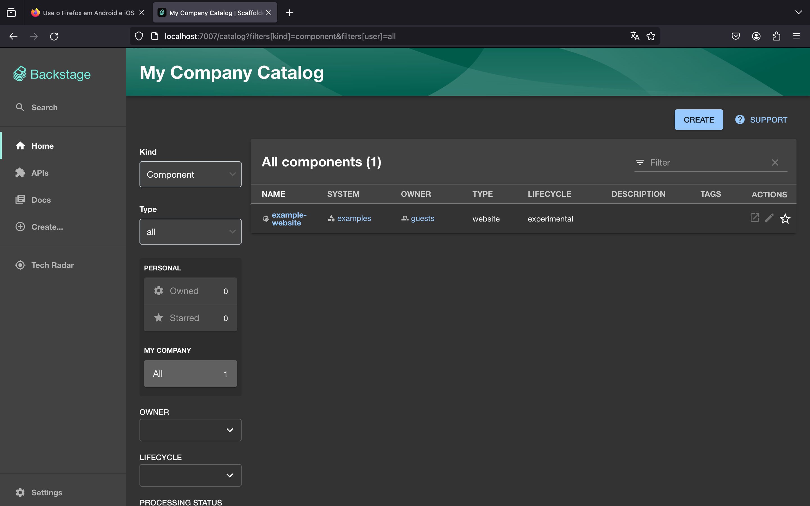

# Deploy Backstage usando Docker

Esse read.me tem o objetivo de auxiliar na realização do deploy do backstage no docker. Backstage é um plataforma desenvolvida pelo Spotify que ajuda na definição de um catálogo de serviços, ou seja, do gerenciamento e visualização de serviços e infraestrutura.

## Instruções de replicação

### Passo 1: instalar o backstage

1. Acesse via terminal o repositório no qual você deseja criar a aplicação;
2. Crie a aplicação com o comando `npx @backstage/create-app@latest --skip-install`;
3. Acesse a pasta da aplicação com `cd nome_da_pasta`;
4. Digite `yarn install` no terminal da aplicação para instalar as dependências necessárias;

### Passo 2: preparar o build do backstage

1. Ainda no terminal da pasta, rode o comando `yarn install --frozen-lockfile`;
2. Rode `yarn tsc` para criar os types do Backstage;
3. Faça o build da aplicação com o comando `yarn build:backend`;

### Passo 3: edição Dockerfile do backstage

1. Navegue até o arquivo Dockerfile, localizado no caminho a seguir: `packages -> backend`;
2. Altere todo o código presente no arquivo Dockerfile pelo código abaixo:

```bash
FROM node:18-bookworm-slim

# Install isolate-vm dependencies, these are needed by the @backstage/plugin-scaffolder-backend.
RUN --mount=type=cache,target=/var/cache/apt,sharing=locked \
    --mount=type=cache,target=/var/lib/apt,sharing=locked \
    apt-get update && \
    apt-get install -y --no-install-recommends python3 g++ build-essential && \
    yarn config set python /usr/bin/python3

# Install sqlite3 dependencies. You can skip this if you don't use sqlite3 in the image,
# in which case you should also move better-sqlite3 to "devDependencies" in package.json.
RUN --mount=type=cache,target=/var/cache/apt,sharing=locked \
    --mount=type=cache,target=/var/lib/apt,sharing=locked \
    apt-get update && \
    apt-get install -y --no-install-recommends libsqlite3-dev

# From here on we use the least-privileged `node` user to run the backend.
USER node

# This should create the app dir as `node`.
# If it is instead created as `root` then the `tar` command below will
# fail: `can't create directory 'packages/': Permission denied`.
# If this occurs, then ensure BuildKit is enabled (`DOCKER_BUILDKIT=1`)
# so the app dir is correctly created as `node`.
WORKDIR /app

# This switches many Node.js dependencies to production mode.
ENV NODE_ENV development

# Copy repo skeleton first, to avoid unnecessary docker cache invalidation.
# The skeleton contains the package.json of each package in the monorepo,
# and along with yarn.lock and the root package.json, that's enough to run yarn install.
COPY --chown=node:node yarn.lock package.json packages/backend/dist/skeleton.tar.gz ./
RUN tar xzf skeleton.tar.gz && rm skeleton.tar.gz

RUN --mount=type=cache,target=/home/node/.cache/yarn,sharing=locked,uid=1000,gid=1000 \
    yarn install --frozen-lockfile --production --network-timeout 300000

# Then copy the rest of the backend bundle, along with any other files we might want.
COPY --chown=node:node packages/backend/dist/bundle.tar.gz app-config*.yaml ./
RUN tar xzf bundle.tar.gz && rm bundle.tar.gz

CMD ["node", "packages/backend", "--config", "app-config.yaml"]
```

### Passo 4: criar imagem do backstage no Docker

1. Execute o comando `docker image build . -f packages/backend/Dockerfile --tag backstage --no-cache` dentro da pasta da aplicação para criar a imagem; 
2. Crie e execute o container do Backstage com o comando `docker run -it -p 7007:7007 backstage`

Prontinho! Agora você realizou todas as etapas necessárias para fazer o deploy do backstage no Docker. Psrs testar, acesse: http://localhost:7007.

**Observação:** Caso você utilize o Safari como navegador, o processo pode não funcionar da melhor maneira, então é recomendável o uso de outro navegador como o FireFox.

## Imagens da execução

### Criar a imagem do Backstage e rodar o container

<p align="center">
    
    </br>
</p>

### Aplicação funcionando

<p align="center">
    
    </br>
</p>